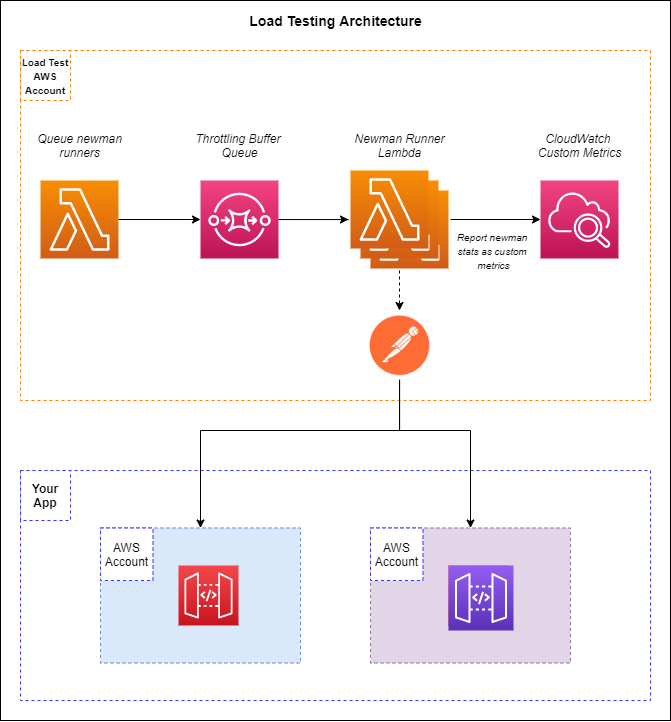
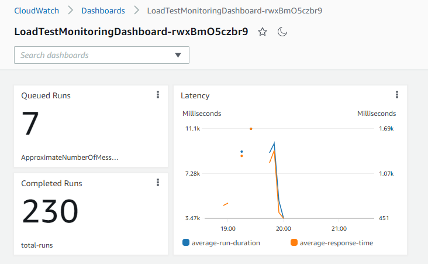

# Serverless Load Testing
Perform load testing with a serverless solution running newman. If you have a Postman collection or set of collections, you can run them through the load testing solution to add load to your system.

## Architecture



To trigger a load test, the `trigger-load-test` lambda function must be executed with details pertaining to the run. The Lambda will create events and drop them into SQS. The `run-newman` function is subscribed to the SQS queue and will fan out with the influx of events.

## Starting a Load Test

To start a load test, you must trigger the `trigger-load-test` function manually either via the AWS Console or through the command line. The load test is setup to pass multiple collections through the system via a *weighted distribution*. 

>Example:<br/><br/>
If your application has *Business Process A* as the use case 60% of the time and *Business Process B* as the use case 40% of the time, you are able to run a load test to simulate that distribution.<br/><br/>
You must create two collections in Postman: one that represents *Business Process A* and another that represents *Business Process B*. When configuring the load test input (see below) specify that the *Business Process A* collection gets 60% of the executions and the *Business Process B* collection gets 40% of the executions

## Input

To facilitate multiple workflows simultaneously, an array of inputs can be added to the execution known as a *distribution*. A distribution is a percentage of the total load test that runs a specific collection. See the example input below:

```json
{
  "count": 1000,
  "distributions": [
    {
      "percentage": 50,
      "name": "Business Process A",
      "s3CollectionPath": "path/to/file.json"
    },
    {
      "percentage": 30,
      "name": "Business Process B",
      "postmanApiKey": "PMAK-mykey",
      "postmanCollectionId": "1234-56-7890"
    },
    {
      "percentage": 20,
      "s3CollectionPath": "other/path/collection.json",
      "postmanApiKey": "PMAK-mykey",
      "postmanEnvironmentId": "9876-54-3210"
    }
  ]
}
```

There are two root level properties that must be passed into the triggering Lambda event:
|Name|Description|Data Type|Required|
|----|-----------|---------|--------|
|`count`|The number of times newman should be run as part of the load test|number|yes|
|`distributions`|The set of business processes and their run weights|array of objects|yes|

----
`distributions` may contain the following properties:

|Name|Description|Data Type|Required|
|----|-----------|---------|--------|
|`percentage`|The percentage of the total number of runs for this distribution|number|yes|
|`name`|Friendly name of the business process represented by the collection. If provided, this creates CloudWatch metrics for the business process|string|no|
|`s3CollectionPath`|Object key of the collection in the Load Testing bucket. *Required if postmanCollectionId is not provided*|string|no|
|`postmanCollectionId`|Unique identifier of the collection hosted in Postman. If provided, the runner will grab the latest version of the collection before starting.|string|no|
|`postmanEnvironmentId`|Unique identifier of the environment hosted in Postman. If provided, the runner will grab the latest version of the environment before starting.|string|no|
|`postmanApiKey`|Api key used to authenticate to your Postman account. *Required if postmanCollectionId or postmanEnvironmentId are provided*|string|no|

**NOTE - The sum of all distributions must equal 100!!** If they do not, the load test will not run.

## Collection and Environment Utilization

There are two ways to pass a collection and environment to the load test runner: **via s3** or **through the Postman API**

**S3 Option** - When using the S3 option, you must first [export your collection](https://learning.postman.com/docs/getting-started/importing-and-exporting-data/#exporting-collections) from Postman and add it to the `LoadTestBucket` created as part of this stack. Once it has been added to the bucket, you will take the *objectKey* of the file and use it as the `s3CollectionPath` property in the load test execution input. This process can be followed if you wish to include the [Postman environment](https://learning.postman.com/docs/sending-requests/managing-environments/) in your executions. With environments, you must set the `s3EnvironmentPath` property in the load test execution input.

**Postman API** - If you have a Postman Basic or higher account, you can use the Postman API to load the current version of your collection and/or environment from your account. If you opt for this method, you only need to provide the identifiers for the collection (`postmanCollectionId`) and environment (`postmanEnvironmentId`) and [your API key](https://blog.postman.com/how-to-use-api-keys/) (`postmanApiKey`).

You are able to mix and match these options for every distribution. This means one distribution can load a collection from S3 while another loads from the Postman API.

*Note - Environments are not required to run a load test. They may be optionally provided if your collection requires it.*

## Deployment

**Prerequisites**
* AWS CLI installed and configured on your machine
* SAM CLI installed and configured on your machine

To deploy this to your AWS account, you can run the following commands provided you have met the prerequisites:

```bash
sam build --parallel
sam deploy --guided
```

These commands will build and deploy the solution into your AWS account. Follow the prompts in the terminal when using `sam deploy --guided`.

## Usage

This stack uses a high amount of concurrent Lambda functions to perform the load test. This means you **should not deploy this stack in the AWS account you are load testing**. Be sure to deploy this to a different AWS account so you are not competing against yourself resources and run into service limits prematurely.

It may also be a good idea to [request a service quota increase](https://docs.aws.amazon.com/servicequotas/latest/userguide/request-quota-increase.html) for concurrent Lambda executions. 

The architecture of the solution will throttle itself in the event you get close to your service limit for concurrent Lambda executions. Since newman runs are queued in SQS, your AWS account will be able to pull from the queue when resources are available.

## Monitoring

This stack will deploy a baseline CloudWatch dashboard for you to monitor latencies and execution runs. 



The load test will track the following metrics under the `load-test` namespace in CloudWatch.

|Name|Description|Distribution Name or Overall|
|----|-----------|----------------------------|
|`total-runs`|Number of times newman has run|Overall|
|`runs`|Number of times newman has run for a specific distribution name|Distribution Name|
|`failed-assertions`|Number of failed assertions in your Postman collections|Both|
|`successful-assertions`|Number of successful assertions in your Postman collections|Overall|
|`average-run-duration`|Time in milliseconds the entire collection took to run|Both|
|`average-response-time`|Average time in milliseconds each request too to respond|Both|

The dashboard can be updated to provide breakdowns on a per distribution name level. It might be valuable information to see if failed assertions increase or average response times increase under load for a specific collection.